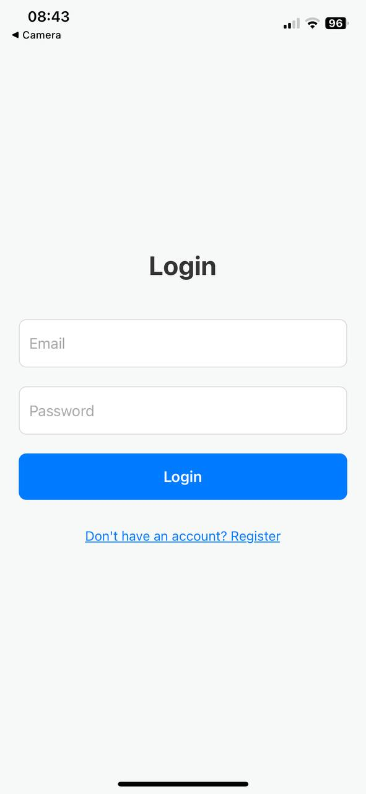
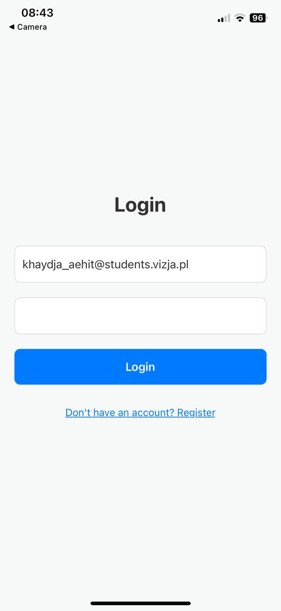

# Banking App with Currency Exchange - [Network Communication in Mobile Appplcation Development (Semester 7)]

## Table of Contents
1. [Overview](#overview)
2. [Tech Stack](#tech-stack)
3. [Running the App](#running-the-app)
4. [Usage](#usage)
5. [Conclusion](#conclusion)

---

## Overview

**Banking App with Currency Exchange** allows users to manage their accounts, wallets, and transactions, while also supporting currency exchange via integration with the <a href="https://api.nbp.pl/" target="_blank">**NBP API**</a> for checking the current and archived exchange rates and it is also used for tranferring funds between wallets.

This is the mobile client built using **React Native(Expo)**. The <a href="https://api.nbp.pl/" target="_blank">**NBP API**</a> is used for fetching current exchange rates for users to see current and archived exchange rates and also it is used when transferring funds between wallets.

You can access the full working <a href="https://github.com/javokhirbek1999/currency-exchange-backend" target="_blank">**Backend API**</a> documentation in order to run it and use it in this Mobile Client.

## Use-case diagram


## Class diagram


## Database Desgin Diagram


For more detailed Backend API Documentation, please check <a href="https://github.com/javokhirbek1999/currency-exchange-backend" target="_blank">**Backend API**</a>.

## Tech Stack

The **Banking App with Currency Exchange Mobile Client** is developed using the following technologies:
- **Javascript**: JavaScript often abbreviated as JS, is a programming language and core technology of the Web.
- **ReactJS**: React is the Javascript library for web and native user interfaces.
- **Expo**: Expo is an open-source platform for making universal native apps for Android, iOS, and the web with JavaScript and React.
- **Expo Go**: can be installed on iOS App Store/Google Play Store.
- **NBP API**: A Polish National Bank API providing exchange rate data.

---

## Running the App

Before running the app, make sure you have the following:
- <a href="https://nodejs.org/" target="_blank">NodeJS</a>
- Expo Go: can be installed on iOS App Store/Google Play Store.
- Backend server already running in your local IP address explained at <a href="https://github.com/javokhirbek1999/currency-exchange-backend?tab=readme-ov-file#running-the-app" target="_blank">**Backend API**</a>.

<br/>

1. Clone the repository:
```bash
git clone https://github.com/javokhirbek1999/currency-exchange-mobile-client.git
```

2. Navigate to the cloned folder and run the following command to install dependencies:
```bash
npm install
```


3. Run the server:

```bash
npx expo start
```

The above command starts your server and you will see the following in your terminal:


4. And now, in order for the Mobile client to access the backend, you need to change backend API endpoint to your backend server URL.

Access the `axios.js` file in the home folder of the mobile client and change the axios base URL to the base URL of your backend as explained in <a href="https://github.com/javokhirbek1999/currency-exchange-backend?tab=readme-ov-file#running-the-app" target="_blank">**Backend API**</a>.


**And now you are all set!!!**


---
## Usage

1. Open your camera or your Expo Go App. You can the QR code to automatically run your app on Expo Go or you can see the app once you open the Expo Go.

**Splash Screen**


2. After Splash Screen, you will see home screen

**Home Screen**


3. Register a new account:

**Registeration Screen**


<p>Fill in the valid details</p>

#### Password already entered but hidden when I did screenshot in iOS
 

<p>Once you filled in the details, enter Register button.</p>


<p>Once the registration is successful, you will be re-directed to Login Screen</p>

**Login Screen**


<p>Fill in your email and password.</p>

#### Again, Password already entered but hidden when I did screenshot in iOS



<p>Once done, click Login Button.</p>

**Dashboard Screen**


<p>As you can see that once the user is successfully registered, the user will have PLN wallet created automatically.</p>

**Wallets Screen**


<p>You can deposit funds by entering your bank account number and the amount. The currency will be automatically deposited in selected wallet currency.</p>


<p>Once you enter your bank account and amount, click deposit.</p>
<p>Once deposit is successful, the money will be deposited to your wallet.</p>


<p>To withdraw money, click withdraw button in your wallet.</p>


<p>Enter your bank account to transfer the withdrawn money to and the amount to withdraw.</p>
<p>Once you enter the both, click Withdraw button to withdraw the money.</p>


<p>You can also add a new wallet.</p>


<p>Enter the current of your new wallet that you want to add.</p>
<p>If you try to add an already existing wallet currency, it will give an error message.</p>


<p>Add a new currency wallet that you dont have yet.</p>


<p>Once you enter a valid wallet currency, click Add Wallet button to add new wallet.</p>

<p>In the screenshot you can see that I am adding a new USD wallet.</p>


<p>As you can see, I have successfully addded a new USD wallet.</p>

**Transfer Funds between Wallets**

<p>To transfer funds between wallets, click transfer funds button and the following modal pops up.</p>


<p>Here you have to select a currency of your wallet that you want to transfer money from and the currency of your wallet that you want to transfer that money to.</p>

<p>In the example below, as you can see, I am trying to transfer 1500 PLN from my PLN wallet to USD wallet and then I am only entering the amount of money that I would like to transfer between these 2 selected wallets. The amount's currency is in from wallet currency.</p>


<p>And now, clikc Transfer and once the transfer is successful, you will see the following success screen.</p>


**Transactions History Screen**


<p>You can see all of your deposit,withdrawl and transfer transactions history in this screen order from latest to the oldest.</p>


**Currency Exchange Rates Screen**


<p>In currency exchange rates screen, you can see the currency exchange rates.</p>

<p>And you can also see the archived exchange rates as well.</p>
<p>In order to see the archived currency exchange rates, you need to click on Select Date for Archived Rates.</p>
<p>Then you need to select the date to see the exchange rates for that date.</p>


<p>Once you select it, then you will see the archived currency exchange rates for that selected date.</p>


<p>As you can see above, I have selected the currency rates for November 14,2016 and I can see the exchange rates for that date.</p>


<p>All of these data is basically being polled from <a href="https://api.nbp.pl/" target="_blank">NBP API</a>.</p>


**User Profile Screen**


<p>Our final screen is user profile screen where you can edit your details and also change password. Once done, you can click update profile and your details will be updated.</p>

---

## Currency Exchange

The **Banking App with Currency Exchange** integrates with the <a href="https://api.nbp.pl/" target="_blank">**NBP API**</a> (Polish National Bank API) to provide live and archived currency exchange rates. This API is used when users performs transfers while transferring funds and seeing the current and archived exchanges rates.

- The available currencies are fetched dynamically from the NBP API.
- When transferring funds between wallets in different currencies, the app automatically applies the current exchange rate.

---


## Conclusion

This **Banking App with Currency Exchange** Mobile App, enables the users to manage their accounts, wallets, transactions, and perform currency conversions using real-time exchange rates from the <a href="https://api.nbp.pl/" target="_blank">**NBP API**</a> as you saw above.

Also, feel free to explore the API through Swagger or use the provided authentication to test requests in the backend repository.

---
